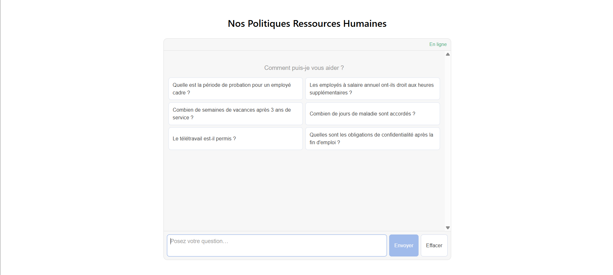

# Agent IA pour les Politiques RH
 
Interface de chat permettant aux employés d'interroger les politiques RH internes en langage naturel, basée par une architecture RAG (ChromaDB + GPT-4o-mini).
 
---
 

 
