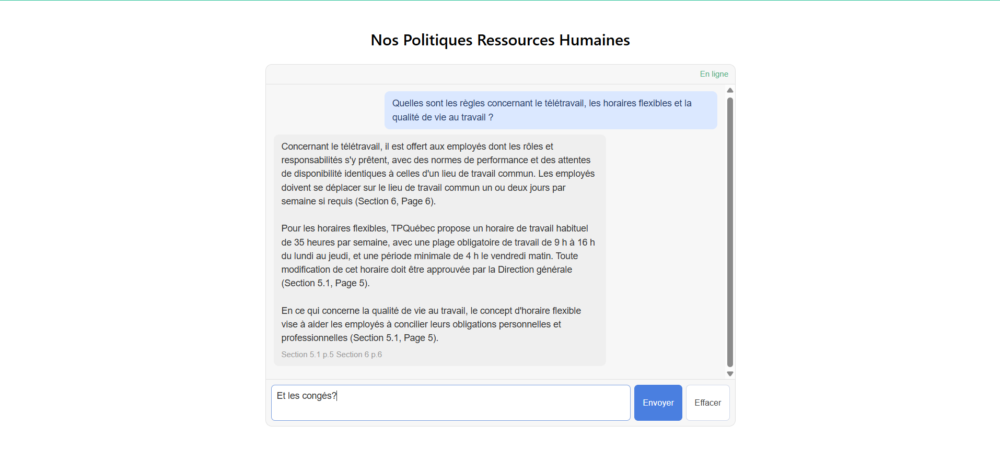

# Document Technique — Agent IA pour les Politiques RH




## 1. Architecture de l'agent
 
### 1.1 Vue d'ensemble
 
L'agent repose sur une architecture RAG (Retrieval-Augmented Generation) qui combine une base de connaissances vectorielle avec un modèle de langage. Cette approche garantit que les réponses proviennent exclusivement du document de politiques internes de l'entreprise exemple, sans hallucination ni utilisation de ressources externes.
 
### 1.2 Composants techniques
 
| Couche | Technologie | Rôle |
|---|---|---|
| Extraction PDF | PyMuPDF (fitz) | Lecture et nettoyage du document RH en pages structurées |
| Chunking | Regex + Logique réutilisable pour d'autre doc | Découpage par section/sous-section puis division en part_1, part_2, etc en fonction du nombre de caractères (réduit les coûts) |
| Embeddings | text-embedding-3-small (OpenAI) | Vectorisation des chunks pour la recherche sémantique |
| Base de données vectorielle | ChromaDB (persistant) | Stockage et recherche par similarité cosinus (top-k=4, seuil=0.5) |
| Modèle LLM | GPT-4o-mini (OpenAI) | Génération de la réponse ancrée dans le contexte |
| Backend API | FastAPI (Python) | Exposition des endpoints `/health` et `/ask` |
| Frontend | Angular 17+ | Interface de chat avec suggestions et affichage des sources |
 
### 1.3 Parcours d'une requête utilisateur
 
```
Utilisateur (Angular)
        |
[1] Pose une question
        |
        v
Backend FastAPI  /ask
        |
[2] Embedding de la question  (text-embedding-3-small)
        |
        v
ChromaDB
        |
[3] Recherche des top-4 chunks les plus similaires
        |
[4] Filtrage par seuil de distance (> 0.5 = refus)
        |
        v
GPT-4o-mini
        |
[5] Génération ancrée avec system prompt strict
        |
        v
Réponse + Sources
```
 
Si le meilleur score de distance dépasse le seuil de 0.5, l'agent retourne directement un message d'impossibilité de réponse sans appeler le LLM, évitant ainsi les hallucinations et les coûts inutiles.

## 2. Instructions système

Consulter `SYSTEM_PROMPT` and `backend/config.py` pour en apprendre sur le prompt système. Celui-ci impose au LLM d'agir comme un assistant RH strict qui doit répondre de manière concise et factuelle en utilisant exclusivement les informations et les sources du document fourni, sans jamais faire appel à des connaissances externes.

## 3. Gestion des cas limites

### Implémentation actuelle
 
Les quatre cas limites (questions hors périmètre, sources contradictoires, demandes sensibles, demandes inappropriées) sont tous gérés de la même façon : le seuil de similarité cosinus (0.5) filtre les questions sans correspondance dans le document, et le message standard est retourné sans appeler le LLM.
 
### Améliorations idéales
 
Avec plus de temps, chaque cas mériterait une gestion spécifique sans juste retourner "information non trouvée":
 
- **Questions hors périmètre** : détecter explicitement l'intention hors-scope et retourner un message clair indiquant que la question dépasse le périmètre de l'agent.
- **Sources contradictoires** : détecter les chunks qui se contredisent et présenter les deux versions avec leurs sections respectives, en laissant l'utiliser choisir.
- **Demandes sensibles** (harcèlement, dénonciation, situations médicales) : classifier ces requêtes en amont et retourner un refus explicite avec redirection vers un humain, sans même tenter une réponse.
- **Demandes inappropriées** : identifier et signaler explicitement que la demande est hors périmètre ou inappropriée.

## 4. Stratégie d'évaluation

Excluant les tests manuels directement sur la plateforme, l'agent a été testé avec quatre tests dans `backend/notebooks/rag_pipeline.ipynb`:
- 3 "bonnes" questions auxquelles l'agent doit être en mesure d'y réponse: "Quelle est la période de probation pour un employé cadre ?", "Les employés à salaire annuel ont-ils droit aux heures supplémentaires ?", "Combien de semaines de vacances après 3 ans de service ?"
- 1 question qui ne devrait pas être répondue / Pas dans la portée du document PDF sur lequel l'agent est basé: "Quelle est la politique de congé parental ?"

Ces tests ont permis d'ajuster le `similarity_threshold` en observant les distances cosinus retournées pour chaque cas.

Des tests supplémentaires seraient nécessaires pour identifier les failles de l'agent, notamment avec des questions formulées différemment (synonymes, paraphrases) pour s'assurer que les sections pertinentes ne sont pas "mal" filtrées par le seuil de similarité.